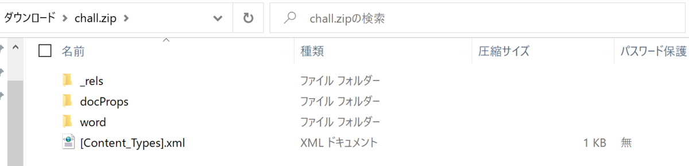

# Word file?

Wordのファイルなはずですが、なぜか開けません

## writeup

`chall.docx`の名前を`chall.zip`に変更すると、解凍できるようになります。



中にあるファイルをダブルクリックするとInternet Explorerで開かれますが、`chall/word/document.xml`だけは真っ白になります。  
メモ帳等で開いてみましょう。

```xml
< ?xml version="1.0" encoding="UTF-8" standalone="yes"?>
<w:document xmlns:wpc="http://schemas.microsoft.com/office/word/2010/wordprocessingCanvas" xmlns:cx="http://schemas.microsoft.com/office/drawing/2014/chartex" xmlns:mc="http://schemas.openxmlformats.org/markup-compatibility/2006" xmlns:o="urn:schemas-microsoft-com:office:office" xmlns:r="http://schemas.openxmlformats.org/officeDocument/2006/relationships" xmlns:m="http://schemas.openxmlformats.org/officeDocument/2006/math" xmlns:v="urn:schemas-microsoft-com:vml" xmlns:wp14="http://schemas.microsoft.com/office/word/2010/wordprocessingDrawing" xmlns:wp="http://schemas.openxmlformats.org/drawingml/2006/wordprocessingDrawing" xmlns:w10="urn:schemas-microsoft-com:office:word" xmlns:w="http://schemas.openxmlformats.org/wordprocessingml/2006/main" xmlns:w14="http://schemas.microsoft.com/office/word/2010/wordml" xmlns:w15="http://schemas.microsoft.com/office/word/2012/wordml" xmlns:w16se="http://schemas.microsoft.com/office/word/2015/wordml/symex" xmlns:wpg="http://schemas.microsoft.com/office/word/2010/wordprocessingGroup" xmlns:wpi="http://schemas.microsoft.com/office/word/2010/wordprocessingInk" xmlns:wne="http://schemas.microsoft.com/office/word/2006/wordml" xmlns:wps="http://schemas.microsoft.com/office/word/2010/wordprocessingShape" mc:Ignorable="w14 w15 w16se wp14"><w:body><w:p w:rsidR="004E583E" w:rsidRDefault="00DD5ECE"><w:r><w:rPr><w:rFonts w:hint="eastAsia"/></w:rPr><w:t>f</w:t></w:r><w:r><w:t>lag{0ffic3_f1l3s_c4n_b3_z1</w:t></w:r><w:bookmarkStart w:id="0" w:name="_GoBack"/><w:bookmarkEnd w:id="0"/><w:r w:rsidRPr="00DD5ECE"><w:t>p</w:t></w:r><w:r><w:t>}</w:t></w:r></w:p><w:sectPr w:rsidR="004E583E"><w:pgSz w:w="11906" w:h="16838"/><w:pgMar w:top="1985" w:right="1701" w:bottom="1701" w:left="1701" w:header="851" w:footer="992" w:gutter="0"/><w:cols w:space="425"/><w:docGrid w:type="lines" w:linePitch="360"/></w:sectPr></w:body></w:document>
```

二行目が長いですが、右の方を見るとflagが書いてあります。

```xml
<w:t>f</w:t></w:r><w:r><w:t>lag{0ffic3_f1l3s_c4n_b3_z1</w:t>(snip)<w:t>p</w:t></w:r><w:r><w:t>}</w:t>
```

散らばってるflagを連結すればflag。 `flag{0ffic3_f1l3s_c4n_b3_z1p}`

> 一番最初の`< ?xml`の部分を`<?xml`に直して圧縮してdocxにすればwordで開けます。
