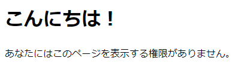
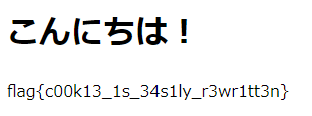

# Are you admin?? (100pt 18solves)

このページには管理者しか見れない情報があるらしい。  

(url)

## 配布ファイル

[distfiles](../distfiles)

## ヒント

配布ファイルのindex.phpのソースコードを読んでみましょう！  
何かが0じゃないときにflagが表示されるようです。  
※ `flag{***CENSORED***}`は配布ファイル用に用意したダミーです。実際のflagとは関係ありません

## writeup

アクセスすると以下のような表示。



権限がないらしい。ソースコードを読んでみる。

```php
<?php
if ($_COOKIE["isadmin"] == 0) {
    echo "<p>あなたにはこのページを表示する権限がありません。</p>";
} else {
    echo "flag{***CENSORED***}";
}
```

Cookieの`isadmin`が0だと権限がない。  
ブラウザの開発者ツールからコンソールで以下を実行し、Cookieを書き換えてページを更新する。

```javascript
document.cookie="isadmin=1"
```



`flag{c00k13_1s_34s1ly_r3wr1tt3n}`
